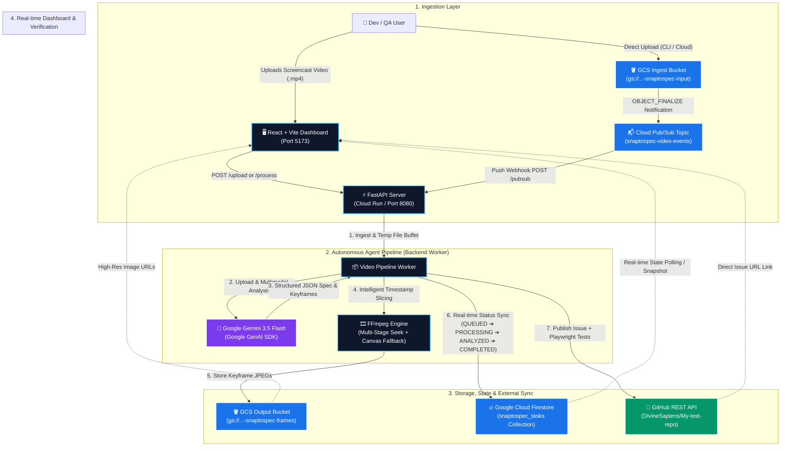

# 🎬 SnapToSpec — Autonomous Video-to-Spec Agent Pipeline

> **Hackathon Track:** Taskmaster (Zero-Chat, Autonomous Background Action)  
> **Core AI Model:** Gemini 3.5 Multimodal Video Reasoning (`gemini-3.5-flash` / `gemini-3.6-flash`)  
> **Infrastructure:** Google Cloud Platform (Cloud Run, Cloud Storage, Pub/Sub, Firestore) + GitHub API + Playwright E2E

---

SnapToSpec is an autonomous, zero-chat agentic pipeline that transforms raw screencast recordings (`.mp4`, `.webm`, `.mov`) into production-grade technical issue specifications. It extracts high-resolution screenshot keyframes at critical timestamps, detects UI defect points, publishes formatted GitHub issues, and synthesizes runnable TypeScript Playwright tests—all with zero human chat interaction.

---

## 🎯 Hackathon Compliance Matrix

| Constraint | Requirement | SnapToSpec Implementation | Status |
| :--- | :--- | :--- | :---: |
| **1. Category** | Taskmaster (Zero-Chat, Autonomous) | Drop a `.mp4` video into GCS bucket &rarr; Pub/Sub trigger &rarr; Cloud Run autonomously analyzes video, slices frames, posts GitHub issue, updates Firestore. **0% chat, 100% action.** | ✅ **Compliant** |
| **2. AI Model** | Gemini 3.5 Multimodal | Native video tokenization via Google GenAI SDK with temporal timestamp grounding and strict Pydantic JSON schema generation. | ✅ **Compliant** |
| **3. Framework** | Google Agent SDK / GenAI SDK | `google-genai` SDK with typed `response_schema` enforcement (`StructuredSpec`, `TimestampsOfInterest`, `ReproductionSteps`). | ✅ **Compliant** |
| **4. Cloud Infrastructure** | GCP Serverless Stack | **Cloud Run** (Containerized Worker), **GCS** (Video ingest & frame hosting), **Pub/Sub** (Push event router), **Firestore** (Real-time task state). | ✅ **Compliant** |

---

## 🏗️ System Architecture

SnapToSpec is built as a **4-layer event-driven pipeline** that operates entirely autonomously — no human interaction required after the initial video upload. Below is a comprehensive breakdown of every layer, component, and data flow.

---

### 📊 Architecture Diagram


---

### 🗺️ Architecture Overview

```
┌─────────────────────────────────────────────────────────────────────┐
│                        LAYER 1: INGESTION                           │
│  React Dashboard ──► FastAPI (Cloud Run)                            │
│  GCS Ingest Bucket ──► Pub/Sub ──► FastAPI (Cloud Run)              │
└────────────────────────────┬────────────────────────────────────────┘
                             │
                             ▼
┌─────────────────────────────────────────────────────────────────────┐
│              LAYER 2: AUTONOMOUS AGENT PIPELINE                     │
│  FastAPI Worker ──► Gemini 3.5 Flash (Multimodal AI)                │
│                   ──► FFmpeg Engine (Keyframe Extraction)           │
└────────────────────────────┬────────────────────────────────────────┘
                             │
                             ▼
┌─────────────────────────────────────────────────────────────────────┐
│              LAYER 3: STORAGE, STATE & EXTERNAL SYNC                │
│  GCS Output Bucket (Frames) + Firestore (Task State) + GitHub API   │
└────────────────────────────┬────────────────────────────────────────┘
                             │
                             ▼
┌─────────────────────────────────────────────────────────────────────┐
│              LAYER 4: REAL-TIME DASHBOARD & VERIFICATION            │
│  React + Vite Dashboard ◄── Firestore Polling + GCS URLs + GitHub   │
└─────────────────────────────────────────────────────────────────────┘
```

---

### 🔬 Layer-by-Layer Breakdown

#### Layer 1 — Ingestion

This layer accepts video input via **two independent entry points**:

| Entry Point | Mechanism | Path |
| :--- | :--- | :--- |
| **Web Dashboard** | User drags & drops a `.mp4`/`.webm`/`.mov` file | `React Dashboard → POST /upload → FastAPI` |
| **GCS Bucket Drop** | File dropped directly into `gs://...-snaptospec-input` | `GCS OBJECT_FINALIZE → Pub/Sub Push → POST /pubsub → FastAPI` |

Both paths converge at the **FastAPI server** (Cloud Run), which queues the task, writes an initial `QUEUED` state to Firestore, and kicks off the async background worker.

#### Layer 2 — Autonomous Agent Pipeline

The core of SnapToSpec. Once a video is received, a **background worker** executes the following deterministic pipeline steps with **zero human input**:

| Step | Component | Action |
| :-: | :--- | :--- |
| **①** | **FastAPI Worker** (`main.py`) | Buffers video to a temp file and spawns the async pipeline |
| **②** | **Google Gemini 3.5 Flash** (`process_video.py`) | Natively tokenizes the full video, identifies UI defect timestamps, extracts reproduction steps, severity rating, and synthesizes a TypeScript Playwright test — all returned as a strict Pydantic-validated JSON schema |
| **③** | **Gemini Response Parser** | Validates `StructuredSpec`, `TimestampsOfInterest`, and `ReproductionSteps` objects with type enforcement |
| **④** | **FFmpeg Engine** (`process_video.py`) | Executes a **3-stage keyframe extraction** strategy: (a) fast-seek, (b) accurate-seek fallback, (c) video-end clamping — guaranteeing non-empty JPEG frames for every Gemini timestamp |

> **Key AI Capability:** Gemini 3.5's native video tokenization means the model reasons across the *entire temporal span* of the recording — not just sampled frames — enabling precise millisecond-level defect localization.

#### Layer 3 — Storage, State & External Sync

After the AI analysis and frame extraction, three parallel outputs are written:

| Output | Destination | Details |
| :--- | :--- | :--- |
| **Keyframe JPEGs** | `GCS Output Bucket` (`gs://...-snaptospec-frames`) | Publicly readable; URLs embedded directly into GitHub issues |
| **Task State** | `Google Cloud Firestore` (`snaptospec_tasks` collection) | Tracks lifecycle: `QUEUED → PROCESSING → ANALYZED → COMPLETED` (or `FAILED`) |
| **GitHub Issue** | `GitHub REST API` via PyGithub | Formatted markdown issue with severity badges, defect summaries, embedded screenshot images, reproduction steps, and the full Playwright TypeScript test block |

#### Layer 4 — Real-Time Dashboard & Verification

The **React + Vite frontend** (`dashboard/`) acts as the live operations console:

| Data Source | Update Method | What It Shows |
| :--- | :--- | :--- |
| **Firestore** | Polling / real-time snapshot listener | Live pipeline state transitions with animated status badges |
| **GCS Frame URLs** | Injected from task document | Zoomable keyframe timeline with timestamps |
| **GitHub Issue URL** | Returned in task document on completion | One-click direct link to the published issue |

---

### 🔄 End-to-End Data Flow

```
1. User uploads video (.mp4)
        │
        ▼
2. FastAPI receives file → writes task {status: QUEUED} to Firestore
        │
        ▼
3. Background worker starts → status: PROCESSING
        │
        ▼
4. Video uploaded to Google GenAI Files API (native tokenization)
        │
        ▼
5. Gemini 3.5 Flash analyzes full video:
   → Returns StructuredSpec JSON:
     • defect_title, severity, description
     • timestamps_of_interest [ {ms, label}, ... ]
     • reproduction_steps [ {action, expected, actual}, ... ]
     • playwright_test (TypeScript string)
        │
        ▼
6. FFmpeg extracts JPEG keyframe for each timestamp → status: ANALYZED
        │
        ├──► Keyframe JPEGs uploaded to GCS Output Bucket
        │
        ├──► Firestore task document updated with frame URLs + spec
        │
        └──► GitHub issue published (markdown + images + Playwright block)
                │
                ▼
        status: COMPLETED
                │
                ▼
7. React Dashboard polls Firestore → renders final spec, frames, and GitHub link
```

---

### 🧩 Component Interaction Map

<details open>
<summary><strong>Interactive Mermaid Flowchart</strong></summary>


</details>

---

### 🔐 Infrastructure & Deployment Model

| Concern | Solution |
| :--- | :--- |
| **Compute** | Google Cloud Run — fully managed, auto-scaling, containerized (Debian 12 + FFmpeg + Python 3.11) |
| **Event Routing** | Cloud Pub/Sub push subscription → Cloud Run `/pubsub` endpoint |
| **Object Storage** | Two GCS buckets: input (private) and output frames (public read) |
| **State Management** | Firestore NoSQL — `snaptospec_tasks` collection with real-time listeners |
| **AI Inference** | Google GenAI SDK (`google-genai`) with `response_schema` Pydantic enforcement |
| **External Integration** | PyGithub REST client for issue publishing |
| **Frontend** | React 18 + Vite + TailwindCSS SPA, served separately from the backend |

---

## 📂 Project Structure

```
├── main.py                  # FastAPI server with /upload, /process, /task/{id}, and /pubsub endpoints
├── process_video.py         # Gemini 3.5 multimodal analysis & robust FFmpeg keyframe extraction
├── integrations.py          # Google Cloud Storage uploader, Firestore state manager, GitHub publisher
├── Dockerfile               # Production container image (Debian 12 + FFmpeg + Python 3.11)
├── deploy.sh                # Automated zero-touch GCP deployment script
├── requirements.txt         # Python dependencies (google-genai, fastapi, google-cloud-storage, etc.)
├── .env.example             # Backend environment variable template
├── dashboard/               # Real-time React + Vite + TailwindCSS Web Dashboard
│   ├── src/
│   │   ├── components/      # UI components (Uploader, StatusFeed, SpecOutputCard, FrameModal)
│   │   ├── services/        # API client and Firestore real-time listener
│   │   ├── App.jsx          # Main dashboard coordinator and live polling engine
│   │   └── index.css        # Rich dark theme design system
│   ├── package.json         # Dashboard dependencies
│   └── .env                 # Frontend backend connection config
└── README.md                # Project documentation & reproduction guide
```

---

## 🛠️ Step-by-Step Local Setup & Execution Guide

Follow these steps to run SnapToSpec locally on Windows, macOS, or Linux.

### 📋 Prerequisites
- **Python 3.10+** (Tested on Python 3.11 / 3.12)
- **Node.js 18+** & `npm`
- **FFmpeg**:
  - *Windows*: `winget install Gyan.FFmpeg` or download from [ffmpeg.org](https://ffmpeg.org/download.html)
  - *macOS*: `brew install ffmpeg`
  - *Linux (Ubuntu/Debian)*: `sudo apt update && sudo apt install -y ffmpeg`
- **Google Gemini API Key** (from [Google AI Studio](https://aistudio.google.com/))
- **GitHub Personal Access Token** (Classic token with `repo` scope from [GitHub Developer Settings](https://github.com/settings/tokens))

---

### Step 1: Clone the Repository & Set Up Virtual Environment

```bash
# Clone the repository
git clone https://github.com/DivineSapiens/SnapToSpec.git
cd SnapToSpec

# Create and activate Python virtual environment
python -m venv venv

# Windows (PowerShell):
.\venv\Scripts\Activate.ps1
# Windows (CMD):
.\venv\Scripts\activate.bat
# Linux / macOS:
source venv/bin/activate

# Install Python backend dependencies
pip install -r requirements.txt
```

---

### Step 2: Configure Environment Variables

Create the backend `.env` file in the root directory:

```bash
# Copy template
cp .env.example .env
```

Edit `.env` with your credentials:

```ini
# ==========================================
# 1. Gemini Multimodal AI
# ==========================================
GEMINI_API_KEY=your_gemini_api_key_here

# ==========================================
# 2. GitHub Integration
# ==========================================
GITHUB_TOKEN=your_github_personal_access_token
GITHUB_REPOSITORY=your_username/your_target_repository

# ==========================================
# 3. Google Cloud Platform Configuration
# ==========================================
GOOGLE_CLOUD_PROJECT=your_gcp_project_id
GCS_OUTPUT_BUCKET=your_gcs_project_id-snaptospec-frames
PORT=8080
```

> **Note on GCP Authentication for Local Run:**  
> Run `gcloud auth application-default login` to enable Cloud Storage & Firestore sync locally. If you run in standalone mode without GCP credentials, the pipeline automatically serves frames via local FastAPI static files (`http://localhost:8080/frames/...`).

Configure the frontend `.env` in `dashboard/`:

```bash
# Navigate to dashboard
cd dashboard
npm install
```

Create `dashboard/.env`:

```ini
VITE_BACKEND_URL=http://localhost:8080
VITE_FIREBASE_PROJECT_ID=your_gcp_project_id
VITE_GCS_OUTPUT_BUCKET=your_gcs_project_id-snaptospec-frames
```

---

### Step 3: Start the Backend FastAPI Server

Open a terminal at the project root:

```bash
# Activate venv
.\venv\Scripts\Activate.ps1  # (or source venv/bin/activate on Unix)

# Start FastAPI backend on port 8080
python -m uvicorn main:app --host 127.0.0.1 --port 8080 --reload
```

*Verification:* Open `http://localhost:8080/health` in your browser. You should receive:
```json
{"status": "healthy", "service": "snaptospec-pipeline"}
```

---

### Step 4: Start the Frontend React Dashboard

Open a second terminal window:

```bash
cd dashboard
npm run dev
```

*Verification:* Open `http://localhost:5173` in your browser to view the interactive SnapToSpec dashboard.

---

### Step 5: Run the Autonomous Pipeline

You can trigger the pipeline in any of the following 3 ways:

#### Option A: Via the Web Dashboard (Recommended)
1. Open `http://localhost:5173`.
2. Drag and drop any screencast recording (`.mp4`, `.webm`, `.mov`).
3. Click **Submit Video**.
4. Watch the real-time workflow transition: `QUEUED` &rarr; `PROCESSING` &rarr; `ANALYZED` &rarr; `COMPLETED`.
5. View the extracted keyframe timeline, deterministic reproduction steps with anomaly detection, Playwright script, and direct link to the published GitHub issue.

#### Option B: Via Command Line (Direct Phase 1 Execution)
```bash
python process_video.py sample_bug_recording.mp4
```

#### Option C: Via REST API
```bash
curl -X POST "http://localhost:8080/upload" \
  -F "file=@sample_bug_recording.mp4"
```

---

## ☁️ Step-by-Step Google Cloud Deployment Guide

SnapToSpec deploys as a fully serverless, event-driven pipeline on Google Cloud.

```
[ Video Upload to GCS ] ──► [ Pub/Sub Notification ] ──► [ Cloud Run Webhook ] ──► [ GitHub / Firestore ]
```

### 1. One-Click Automated Deployment
Make the deployment script executable and run:

```bash
chmod +x deploy.sh
./deploy.sh
```

### 2. Manual Step-by-Step Deployment Commands

If you prefer to deploy step-by-step manually using the Google Cloud SDK (`gcloud`):

```bash
# 1. Set environment variables
export PROJECT_ID=$(gcloud config get-value project)
export REGION="us-central1"
export INGEST_BUCKET="${PROJECT_ID}-snaptospec-input"
export FRAMES_BUCKET="${PROJECT_ID}-snaptospec-frames"
export TOPIC_NAME="snaptospec-video-events"
export SERVICE_NAME="snaptospec-agent"

# 2. Enable required GCP services
gcloud services enable \
  run.googleapis.com \
  artifactregistry.googleapis.com \
  cloudbuild.googleapis.com \
  pubsub.googleapis.com \
  storage.googleapis.com \
  firestore.googleapis.com

# 3. Create Cloud Storage buckets
gcloud storage buckets create gs://${INGEST_BUCKET} --location=${REGION}
gcloud storage buckets create gs://${FRAMES_BUCKET} --location=${REGION}

# Make frames bucket publicly readable for GitHub issue rendering
gcloud storage buckets add-iam-policy-binding gs://${FRAMES_BUCKET} \
  --member=allUsers \
  --role=roles/storage.objectViewer

# 4. Create Pub/Sub Topic and GCS Notification trigger
gcloud pubsub topics create ${TOPIC_NAME}
gcloud storage buckets notifications create gs://${INGEST_BUCKET} \
  --topic=${TOPIC_NAME} \
  --event-types=OBJECT_FINALIZE

# 5. Build and Deploy Container to Cloud Run
gcloud run deploy ${SERVICE_NAME} \
  --source . \
  --region ${REGION} \
  --platform managed \
  --allow-unauthenticated \
  --memory 2Gi \
  --cpu 2 \
  --timeout 600 \
  --set-env-vars GEMINI_API_KEY="your_gemini_key",GITHUB_TOKEN="your_gh_token",GITHUB_REPOSITORY="username/repo",GCS_OUTPUT_BUCKET="${FRAMES_BUCKET}"

# 6. Create Pub/Sub Push Subscription to Cloud Run
SERVICE_URL=$(gcloud run services describe ${SERVICE_NAME} --region ${REGION} --format='value(status.url)')
gcloud pubsub subscriptions create snaptospec-cloudrun-sub \
  --topic ${TOPIC_NAME} \
  --push-endpoint="${SERVICE_URL}/pubsub" \
  --ack-deadline=600
```

### 3. Test Zero-Chat Cloud Autonomous Trigger:
Upload any video directly to the input bucket:

```bash
gcloud storage cp test_recording.mp4 gs://${PROJECT_ID}-snaptospec-input/
```

Within seconds:
1. GCS triggers the Pub/Sub `OBJECT_FINALIZE` event.
2. Cloud Run receives the push event, downloads the video, and runs Gemini 3.5 multimodal analysis.
3. FFmpeg extracts frame snapshots and uploads them to `gs://${PROJECT_ID}-snaptospec-frames/`.
4. The GitHub issue is published with embedded screenshots and the Playwright test script.
5. Task status transitions to `COMPLETED` in Firestore.

---

## 🧪 Testing the Generated Playwright Test

SnapToSpec synthesizes runnable TypeScript Playwright end-to-end tests for every analyzed video. To execute the generated tests:

```bash
# Initialize Playwright in your test repo
npm init playwright@latest

# Paste the synthesized test script into tests/reproduce_issue.spec.ts
# Run headless test:
npx playwright test tests/reproduce_issue.spec.ts --headed
```

---

## 🏆 Key Innovations

1. **Zero-Chat Autonomy:** Completely replaces back-and-forth prompt chat with an event-driven background pipeline triggered simply by uploading video.
2. **Native Video Tokenization:** Uses Gemini 3.5's native video understanding to correlate visual frames directly with UI actions and console events.
3. **Multi-Stage Keyframe Extraction:** Resilient FFmpeg pipeline with fast-seek, accurate-seek, and video-end clamping to eliminate empty frames or broken links.
4. **Automated Playwright Synthesis:** Generates fully typed, executable TypeScript test scripts with exact selector assertions to prevent regressions.

---

## 📄 License
MIT License. Created for the Google Cloud & Gemini Multimodal Agentic Hackathon.
